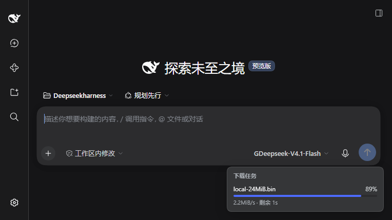

# dsh-smart-dl

[](https://www.npmjs.com/package/@leisureyu/dsh-smart-dl)
[](https://www.npmjs.com/package/@leisureyu/dsh-smart-dl)
[](https://www.npmjs.com/package/@leisureyu/dsh-smart-dl)
[](https://github.com/LeiSureYu/dsh-smart-download/actions/workflows/publish.yml)

[](https://dsh-plugin.org/plugins/leisureyu/dsh-smart-download)

[简体中文](./README.md) · **English**

> **A downloader with aria2 built in, for DSH.** One command to install, nothing else to set up: large files download over multiple connections, it falls back automatically when a server won't cooperate, and an interrupted download can be resumed.



```bash
dsh plugin --profile web add @leisureyu/dsh-smart-dl
```

The desktop app (DeepSeek Harness 0.2.0 and newer) installs the same package: use the app's own CLI, or the **Plugins** page in the sidebar.

- **Automatic multi-connection acceleration** — the target server is probed first; if it supports multiple connections the bundled `aria2c` downloads concurrently, otherwise it falls back to the system `curl`, so the download completes either way.
- **Zero configuration** — the aria2 binaries ship with the plugin via npm `optionalDependencies`; no manual download and no PATH setup.
- **Visible progress** — on profiles with the web UI (`web`, or the desktop app) a live panel sits in the bottom-right corner (file name / percentage / speed / ETA) and clears itself when the download finishes.
- **Resumable downloads** — call again with the same `url` + `output` to resume an interrupted download.
- **Queryable progress** — the `download_status` tool reads back percentage / speed / ETA of recent tasks.

All four of **Windows x64 / arm64** and **Linux x64 / arm64** are fully supported (bundled aria2,
multi-connection). macOS installs and works, but always downloads over single-threaded `curl` —
see [COMPATIBILITY.md](./docs/COMPATIBILITY.md) for why, and for why no macOS build was hacked together.

`dsh-smart-dl` registers two tools with DSH:

- **`smart_download`** — download a file. It first probes whether the target server supports multi-threading; if it does it calls the bundled `aria2c` for accelerated multi-connection download, otherwise it falls back to the system `curl` single-threaded download, so the download completes either way. Supports an optional mirror prefix and resume.
- **`download_status`** — query download progress. Returns a read-only snapshot of recent tasks (percentage, speed, ETA), useful for answering "how far along is that download?".

## Install

```bash
dsh plugin --profile web add @leisureyu/dsh-smart-dl
```

No further configuration is needed: the aria2 binaries are installed together with the plugin via npm `optionalDependencies`.

**Supported profiles**: `web` and `desktop` (the desktop app from 0.2.0 on). The install command is shaped `dsh plugin --profile <profile> add <package>`; substitute `<profile>` with the profile you actually use.

**On the desktop app, install with the app's bundled CLI**, not with a separately installed `dsh` (the desktop profile is managed exclusively by the Electron application):

```powershell
& "$env:LOCALAPPDATA\Programs\DeepSeek Harness\resources\runtime\cli\bin\dsh.cmd" plugin --profile desktop add @leisureyu/dsh-smart-dl
```

You can also add it from the **Plugins** page in the desktop sidebar.

### Installing from a Git repository URL

Besides the npm package name, the repository URL works too:

```bash
dsh plugin --profile web add https://github.com/LeiSureYu/dsh-smart-download
```

Requirements and caveats:

- The URL must have the three-segment `https://<host>/<owner>/<repo>` shape (an optional `.git` suffix or `#<ref>` is fine). Proxy-mirror URLs with an embedded path prefix (e.g. `https://ghfast.top/https://github.com/owner/repo.git`) are **not accepted**.
- A git / tarball install **fetches the repository contents directly**: `dist/` is committed, so there is no local build, `prepare` does not run, and `allowBuilds` approval is irrelevant. The `files` field still applies to git installs, so source files not listed in it are not installed.
- Compatibility (`peerDependencies`) is only evaluated after the fetch; on a mismatch the profile files are rolled back and no half-installed state is left behind.
- Before installing, DSH probes **GitHub** with `git ls-remote` and fails after a 5-second timeout. If `github.com` is unreachable from your network, this check fails — install the npm package `@leisureyu/dsh-smart-dl` instead (recommended), or use the plugin marketplace.

> **The progress panel is available on profiles that have the web UI** (`web`, and the desktop app's `desktop` profile). On other profiles the plugin works exactly the same — there is simply no UI panel, and you can still query progress with the `download_status` tool.

> **1.1.0 adapts the plugin to DSH 0.2.0.** From 0.2.0 on, DSH checks declared `peerDependencies` before installing: `0.4.0` and earlier declare a range that does not cover `0.2.0`, so an already-installed copy has its whole bundle skipped and the plugin never loads. If you are on `0.4.0` or older, upgrading is the fix; `0.4.1` and newer already cover 0.2.0 — see [COMPATIBILITY.md](./docs/COMPATIBILITY.md).
>
> **1.0.0 was the first stable release.** Compared with 0.9.x, this version stops hiding the places where the plugin silently degrades: "verification skipped" is no longer the same value as "verification passed" (new `verifySkipped` field), a cancelled download reports `cancelled` instead of masquerading as a failure, and two real 0.9.0 problems are fixed — the `mirror` argument could bypass the protocol allow-list (a `file://` prefix would copy a local file out), and the `awaitFlush` timeout timer was not `unref`ed, so the CLI stayed alive about 2 seconds longer after every download. Every item is backed by a reproduction in [REVIEW-1.0.md](./docs/REVIEW-1.0.md).
>
> **Use `1.1.0` or newer.** The history from 0.7.0 through 0.9.0 (integrity verification, the resume fingerprint, the progress-track `state` field, the panel, the cross-platform binaries) is not repeated here — see [CHANGELOG.md](./CHANGELOG.md).
>
> The older `0.1.x` / `0.2.1` releases have install-time defects (manifest validation, `peerDependencies` ranges that could not resolve to any prerelease). Do not use them; upgrade to `1.1.0`.

## How it works

The decision flow, in text:

```
call smart_download(url, output?, mirror?)
        │
        ▼
[0] validate the protocol: only http / https are accepted;
     anything else is rejected before any request
        │
        ▼
[1] if mirror is given, prepend the prefix to the URL
     · mirror prefix + full original URL
     · skipped for non-http(s) URLs
     · output filename still derived from the original URL
        │
        ▼
[2] Probe the URL (5s timeout)
     · send a HEAD request first
     · if HEAD returns 405 or no Content-Length,
       retry with GET + "Range: bytes=0-0"
        │
        ▼
[3] decide() picks a tier by file size and aria2 availability:
     · no Range support / probe failed / size unknown / <1MB -> curl
     · 1MB ~ 8MB   -> aria2 with 4 connections
     · ≥ 8MB       -> aria2 with 8 connections (conservative cap, not 16)
        │
   ┌────┴──────────────────────────┐
   ▼ aria2 tier                     ▼ curl tier
[4a] bundled aria2c found?          [4b] curl single-threaded
   │ yes             │ no             (with progress bar)
   ▼                 ▼
 aria2 4/8 conns   curl single-threaded (fallback)
 (per-second summary progress)
 (resume: -c)      (resume: -C - when Range is supported)
   │ on failure
   ▼
  degrade to curl single-threaded
         │
         ▼
[5] integrity check: bytes on disk vs declared remote length
        │ match             │ mismatch
        ▼                   ▼
   clear .part.json     throw, keep marker
   return success

  return { success, path, method, size, fellback, reason?, requestedUrl, mirrored }
```

Key points:

- **Any probe anomaly** (timeout, network error, unknown file size) is safely treated as "multi-threading unsupported", so the download falls back to curl instead of failing outright.
- The connection count is chosen dynamically by file size (thresholds 1MB / 8MB). `reason` distinguishes cases such as "no Range support", "file too small", and "aria2 missing". The thresholds are measured, not guessed — see "The concurrency thresholds are measured" below.
- **The downloaded size is verified after every download.** An exit code of 0 from `curl` / `aria2` only means "the tool thinks it finished", not that the byte count is right. Short reads, over-reads, and mirrors returning a 200 error page all exit 0; only comparing bytes on disk catches them (see "Guarding against silent failures").
- `requestedUrl` is the **URL actually requested** (mirror prefix + original URL when a mirror is used); `mirrored` reports whether the mirror was applied.
- **Only `http` / `https` are accepted.** A URL can come from any page the model happens to read, so it is untrusted input: other protocols (`file:`, `ftp:`, …) are rejected before any probe or download starts.
- **The derived output filename is sanitised.** When `output` is omitted the filename is derived from the URL, and the result is always a **single path segment** — `/`, `\`, `..` in the URI-decoded value are discarded, so nothing can be written outside the working directory.

### Why the protocol allow-list and filename sanitisation are mandatory (reproduced; do not remove)

> Reproduced on `0.4.1`: `file:///C:/Windows/win.ini` was accepted by `curl` and **successfully copied a local file** to the output path; and `http://host/..%2F..%2F..%2Fescaped.txt` decoded to `../../../escaped.txt`, so with no `output` argument the file was written **outside the current working directory** (verified written). Both are fixed in `0.4.2` — the first by the protocol allow-list, the second by "split again after decoding, keep the last segment, then sanitise".

## Mirror acceleration

When downloads from GitHub Releases and similar hosts are slow, pass a `mirror` prefix to `smart_download`; the plugin prepends it to the original URL:

```
smart_download(
  url: "https://github.com/owner/repo/releases/download/v1/a.zip",
  mirror: "https://gh-proxy.com/"
)
# actually requests: https://gh-proxy.com/https://github.com/owner/repo/releases/download/v1/a.zip
```

Details:

- It is a plain **prefix concatenation** with no path rewriting, so it works with most public mirrors of the "prefix + full original URL" shape.
- A **missing trailing slash is added automatically**, and a bare domain is accepted (`ghfast.top` becomes `https://ghfast.top/`).
- Non-`http(s)` URLs skip the mirror, and **the mirror prefix itself must pass the same allow-list** — a non-`http(s)` prefix (`file://`, `javascript://`, `data://`…) never takes effect and the original URL is used unchanged. The prefix decides the scheme of the concatenated string, so not checking it would open a `file://` back door (fixed in 1.0.0; reproduction in [SECURITY.md](./docs/SECURITY.md)).
- The output filename is always derived from the **original** URL, so the mirror host never leaks into the filename.

Commonly used public mirrors (pick one; availability varies by network):

| Mirror prefix |
| --- |
| `https://gh-proxy.com/` |
| `https://ghfast.top/` |
| `https://ghproxy.net/` |

> Mirrors are **third-party services**: your request passes through them. Do not use a mirror for files containing sensitive data.

## Resumable downloads

If a download is interrupted, calling `smart_download` again with the same `url` and `output` resumes from where it stopped instead of starting over:

- **aria2 path**: `-c` is used only when the partial file can be proven to come from the same resource; otherwise the download runs without `-c` and with `--allow-overwrite=true`.
- **curl path**: `-C -` is added **only when the probe confirms Range support *and* the partial file can be proven to come from the same resource**.

Why resume needs a check beyond "Range is supported" (measured, do not simplify):

> Measured on `0.6.0` with real curl 8.13.0 and the bundled aria2 1.37.0 on 127.0.0.1: when the remote shrank from 400 to 200 bytes, both `curl -C -` and `aria2 -c` **exited 0 with the stale 400 bytes still on disk**; when the remote kept the same length with different content, both again **exited 0 with the old content intact**. "Supports Range" only means the transfer can resume — not that it is resuming the same file.
> So resume now compares the remote length against `ETag` / `Last-Modified` (fingerprinted in a `<output>.part.json` sidecar, cleared on success and kept on interruption), and deletes the local partial when the same origin cannot be proven. Length alone catches the first two cases but not "same length, different content", which is why the sidecar fingerprint exists.

Why curl's resume is conditional (measured, do not make it unconditional):

> `curl -C -` **fails outright with exit code 33** when the server does **not** support Range and a partial file already exists — measured: a 1000-byte resource with an existing 400-byte partial → `exit 33`, file left intact at 400 bytes, while the **same scenario without** `-C -` re-downloads the full file successfully.
> With Range support, all three cases are measured correct: resuming a partial file, re-running after completion, and starting from scratch with no file present.

## Querying progress: download_status

`download_status` returns a read-only snapshot of this plugin's download tasks — use it to answer "how far along is that download?".

```
download_status()                      # list the 10 most recent tasks
download_status(limit: 3)              # list only the 3 most recent
download_status(taskId: "dl-xxx")      # look up one task
```

Example result:

```json
{
  "ok": true,
  "taskDir": "/path/.dsh-progress/<session-id>",
  "downloadDir": "/home/u/.dsh/downloads/tasks",
  "total": 1,
  "tasks": [
    {
      "id": "dl-mulfpr76-z47a",
      "name": "local-24MiB.bin",
      "pct": 100,
      "msg": "download finished",
      "status": "completed",
      "spd": "8.2MB/s",
      "eta": "",
      "updatedAt": 1759000000000
    }
  ]
}
```

Constraints and trade-offs:

- **Purely read-only**: it writes nothing and performs no network access. It reads exactly the two progress-track directories described in "Progress reporting".
- **Fault-tolerant first**: a missing directory, insufficient permissions, or corrupted file contents all degrade to "that task does not appear in the result" — the call still succeeds (just with a shorter list), so querying status never breaks a download.
- Tasks are ordered by `updatedAt` **descending**, newest first. `total` is the **untruncated** count; `tasks` is truncated by `limit`.
- `name` is the output file name (used for display in the panel and the list); it falls back to the task ID when unknown.
- `spd` / `eta` return an **empty string** when unavailable or unknown (the schema requires a string) — never `null` or `undefined`.

## Progress reporting

Progress is written through `ProgressReporter` on **two tracks**; if either track is unwritable it fails silently without affecting the download:

- Track 1 (dsh-task-progress format): `$DSH_PROGRESS_DIR/<taskId>.jsonl`, one JSON object per line, append-only. **DSH 0.2.0 no longer ships a reader for it**; only the third-party [`dsh-task-progress`](https://www.npmjs.com/package/dsh-task-progress) plugin reads this format. Track 2 and the built-in panel are unaffected. When that variable is unset the default is `<session.cwd>/.dsh-progress/<session.id>/<taskId>.jsonl` (the session id and working directory come from `exec.agent.session.header`). **With no session context, track 1 is not written at all** — the dsh-task-progress reader filters by session, so writing to the wrong directory is the same as not writing.
- Track 2 (this plugin's own format): `$DSH_DOWNLOAD_PROGRESS_DIR/<taskId>.json`, defaulting to `<DSH_HOME>/downloads/tasks/<taskId>.json` (`DSH_HOME` defaults to `~/.dsh`), overwritten as a whole.

Every record carries a `state` field (`running` / `done` / `failed` / `cancelled`): the dsh-task-progress reader only looks at `state` and treats a missing one as `running`, which is why pre-0.5.0 records with `pct=100` and `msg=下载完成` still showed "downloading" forever. Progress is **de-duplicated by the whole record** (`pct + state + msg + spd + eta` must all match to skip); any change is written, so the panel sees live speed and ETA, and terminal states (completed / failed / cancelled) always break through because `state` changed. aria2 output is parsed from the `--summary-interval=1` summary lines (including speed and ETA); curl is parsed from `--progress-bar` percentages.

Since `0.6.0` writing is **asynchronous**: `report()` only enqueues a record and a microtask batch-writes it in order, so the download loop is no longer blocked by a synchronous `appendFileSync`. Callers `await reporter.awaitFlush()` before returning, so `download_status` and the panel always read a terminal state rather than the last intermediate one.

## Progress panel in the UI (web / desktop)

On profiles with the web UI (`web`, and the desktop app's `desktop`) the plugin mounts a **live progress panel** in the bottom-right corner of the interface. It appears automatically while a download is running and shows the **output file name, percentage, transfer speed and ETA**; when the download completes it briefly shows a "finished" receipt and then disappears. When idle it renders nothing at all.


Implementation notes (useful for troubleshooting a panel that does not show up):

- **Host RPC**: the client polls the progress snapshot through `/api/smartdl.status`, registered via `connection.fetch.register`; it reads the same progress files as the `download_status` tool.
- **Slot**: it registers into `shell.overlay` (`kind: 'list'`, `order: 100`), so it never replaces the host's own UI, and renders `null` when there is nothing to show.
- **`react` only**: the client script is registered as a classic script through `window.__ModuleLoader__.load`; there is no bundler.
- **Stale tasks are ignored**: a `running` task that has not been updated for more than 10 minutes no longer counts toward the panel, so leftover files from old runs cannot pin it on screen forever.

> This panel is `web`-profile only. On other profiles the client registration is silently skipped and the tools and download behaviour are unaffected.

## Guarding against silent failures

Three **silent failures of the same kind** were found during development:

1. **aria2 summary format changed**: with readout disabled, the GID became hexadecimal, the `SIZE:` prefix disappeared, and the speed field changed from `SPD:` to `DL:`.
2. **curl `--silent` suppresses progress**: even though progress goes to stderr, `--silent` also suppresses `--progress-bar`.
3. **aria2 omits ETA near completion**: summary lines close to 100% omit the ETA field entirely.

None of these are logic errors — they are **wrong assumptions about how an external program actually behaves**. The logic was right, the tests were green, and the download succeeded; only one step quietly returned a default value ("unsupported" / `curl` / `null` / skip writing). The danger is that the exit code is still 0, so tests that only assert "does not throw" can never catch them.

0.5.0 caught three more of the same kind: **track 1 missing `state`** (the panel shows "downloading" forever), **writing progress into a directory nobody reads when there is no session**, and **`DSH_HOME` not taking effect, so progress landed in a stale home**. 0.6.0 caught the most dangerous kind: **silent resume corruption** (`curl -C -` / `aria2 -c` exit 0 with wrong bytes when the remote shrank or changed) and **aria2 writing the new content to `f.1.bin` while the returned `path` still points at the stale file**. Both report success with a wrong artifact — only a positive assertion like "are the bytes on disk actually the remote's bytes" can find them. None of them throw and all tests were green — only a positive assertion like "does the panel / status query actually report the right state", or "is the file actually the remote one", can find them.

**0.7.0 caught "the tool reports success but the byte count is wrong"**: when the server uses chunked encoding and closes cleanly after 1MB, the bundled aria2 1.37.0 exits with code **0** and prints `OK` in its Download Results, yet only 1MB landed on disk (4MB was declared). `curl` exits 0 in the same scenario. No non-zero exit code exists to detect it; only comparing bytes on disk after the download finds it. See the next section.

**0.8.0 patched a hole in the guard rails themselves**: `/api/smartdl.status` (the single host endpoint
shared by the web progress panel and `download_status`) was the least-covered module in the project —
excluding its dedicated test file, measured function coverage of just **2/7** and line coverage
**62.37%**, with `ok`, `fail`, `envelopeResponse`, `readPayload` and the whole handler body at
`count=0`, never executed even once. In other words, its guards against "silently falling back on an
invalid request" and "not leaking a bare 500 on a business exception" existed in code but had never
been proven by any test — exactly the part most easily broken by a later refactor. 0.8.0 adds
`test/rpc.test.ts` (21 cases), bringing it to **9/9** and **99.46%** line coverage, and every skip /
fallback path asserts the **concrete value** it fell back to rather than merely "does not throw".

> All coverage numbers come from Node's built-in `--experimental-test-coverage` (see the "Development"
> section below). The `6/16` / `16/26` figures printed in the 0.8.0 docs came from a hand-rolled
> `NODE_V8_COVERAGE` tally, which inflates the function count on Windows + tsx because of source-map
> misalignment. That method is retired; from this version on the built-in coverage is the only source.

**Contract**: every path in this plugin that "returns a default value" —

| Stage                | Silent failure form       | Positive signal that must be asserted                  |
| -------------------- | ------------------------- | ------------------------------------------------------ |
| `probeUrl`           | probe error → unsupported | a known-good URL must return `supportsMultiThread: true` |
| `decide`             | missing branch → curl     | a known large file must return `method: 'aria2'`        |
| `parseAria2Summary`  | not recognized → `null`   | real samples must parse out `pct/spd(/eta)`             |
| `parseCurlProgress`  | not recognized → `null`   | real samples must parse percentages rising to 100%      |
| `ProgressReporter`   | dir unwritable → skipped  | a writable dir must contain a file with growing content |
| `LineBuffer`         | bad split state           | chunk / `\r` / `\r\n` boundaries must split correctly   |
| `applyMirror`        | mis-concatenated URL; **non-http(s) prefix → allow-list bypass** | the result must parse via `new URL()` and end with the original URL; a `file://` / `javascript://` / `data://` prefix must **not take effect** and the original URL must be returned unchanged |
| `readDownloadStatus` | unreadable → empty list   | a dir containing valid task files must yield tasks with parsed fields |
| `buildCurlArgs`      | resume flag misplaced     | `-C -` must be present iff `resume`, and `-o` must stay adjacent to the path |
| `checkDownloadUrl`   | protocol unchecked → local file read | `file://` / `ftp://` must be rejected; `http(s)` must be admitted and return a parsed URL |
| `deriveFilenameFromUrl` | no sanitisation → path traversal | `..%2F..%2F..%2Fescaped.txt` must derive the single segment `escaped.txt`, and the actual write must not escape the current directory |
| `ProgressReporter`   | track 1 missing `state` → panel stuck on "downloading" | terminal records must carry `state: 'done' / 'failed' / 'cancelled'`, and `readDownloadStatus` must report completed / failed / cancelled from it |
| `resolveTaskProgressDir` | no session → writes to a directory nobody reads | must return `null` (i.e. skip track 1) when neither `DSH_PROGRESS_DIR` nor a session is present, and `<cwd>/.dsh-progress/<id>` when a session is present |
| `resolveDshHome`     | ignores `DSH_HOME` → writes to a stale home | `DSH_HOME` must take effect; empty / whitespace-only must fall back to `~/.dsh` |
| `statusFrom`         | message-only inference → wrong status | when a record carries `state`, it must win (`state: 'running'` plus the message "下载完成" is still running) |
| `verifySize`         | exit code 0 with wrong byte count → treated as success | matching bytes must return `ok`; a **chunked truncation** (both aria2 and curl exit 0) must be reported as a failure; "declared length unknown" and "server returned a compressed encoding" must return a **distinct `skipped`** (with a machine-readable `reason`), never the same shape as `ok` |
| `probeUrl` `accept-encoding` | default `gzip, deflate` → compressed length | the server must receive `identity`, and the probe must return the **uncompressed** length (5000, not 41) |
| `registerStatusRpc` handler | invalid request → default value / silent pass-through | with no `connection` it must register **exactly 0 routes**; an invalid envelope must answer `ok:false` with `rpcId='invalid-request'`; an invalid `limit` must fall back to `DEFAULT_STATUS_LIMIT` (10, not 0 / `Infinity`); a business-layer exception must still be 200 + `ok:false` (never a bare 500) |

Every assertion is **positive**: it checks "did it actually produce output", not "did it avoid crashing". Real samples live in `test/fixtures/` (curl fixtures are `.bin` files preserving `\r`), and "the fixture must contain `\r`" is itself a forced assertion.

> If you ever find a default-returning path that is not covered by a positive signal assertion, **that is a bug, not a design**. Relaxing a positive assertion back to "as long as it does not throw" reopens the silent-failure door.

In addition, `test/meta-test-discovery.test.ts` enumerates every test file under `test/` and asserts that the `test` script (glob) actually covers them — so even "is CI really running these tests" is itself verified, preventing the guard rails from silently rotting inside CI.

## The concurrency thresholds are measured, not guessed

Before `0.7.0`, the 1MB / 50MB thresholds were guesses. Measurement changed one of them and confirmed two previously unknown traps.

**Controlled experiment**: a local server throttles **per connection** to 2MB/s (modelling the real-world case where a single connection is throttled but multiple connections add up). Arguments come from the plugin's real `buildAria2Args`; each combination runs 3 rounds and the median is reported:

| File size | curl (1 conn) | x=2 | x=4 | x=8 | x=16 |
| --- | --- | --- | --- | --- | --- |
| 2MB | 1.74 | **3.26** | 3.18 | 3.16 | 3.11 |
| 8MB | 1.65 | 3.25 | 6.26 | **11.99** | 12.23 |
| 32MB | 1.67 | 3.08 | 6.22 | 12.21 | **23.15** |
| 64MB | 1.62 | 3.29 | 6.63 | 12.88 | **24.42** |

(MB/s. A public-network control was not usable: on npmmirror a single connection already saturates the local bandwidth, with 10.6–26.9 MB/s variance; the aliyun mirror returns 403 to aria2's user agent.)

Three conclusions:

1. **Concurrency genuinely helps, and the gain is close to linear** — above 8MB, 2 connections ≈ 2× and 4 connections ≈ 4×.
2. **The effective connection count is capped by file size**: a 2MB file tops out at x=2 (3.26), and raising it to 4/8/16 slightly *lowers* throughput to 3.1x, because once the number of splits and connections exceeds what the file can carry only connection overhead remains.
3. Therefore **`LARGE_FILE` was lowered from 50MB to 8MB**: the whole 8–50MB band had been stuck on 4 connections, while a measured 8MB file runs at 11.99 MB/s with x=8 versus 6.26 MB/s with x=4 — nearly double.

The 8-connection cap stays: at 32/64MB, x=16 really is twice as fast again (23–24 MB/s), but it is deliberately not adopted to avoid tripping per-IP concurrency limits on servers.

### Two traps that would have disabled concurrency entirely

- **aria2's `-x/-s` are silently defeated by `min-split-size`.** aria2 defaults to `--min-split-size=20M`; for files under 20MB it does **not split at all** — measured with an 8MB file, it issued a single GET without a Range header, making `-x 16 -s 16` a no-op with single-connection throughput. This plugin passes `-k 1M` and avoids it by luck. Deleting `-k 1M` silently degrades every tier above to a single connection with no error at all, so that line carries a warning comment in the source. Separately, `--min-split-size=512K` makes aria2 fail outright with exit code 28, so 1M is the value verified as safe.
- **The probe must force `accept-encoding: identity`.** Node's `fetch` sends `gzip, deflate` by default, while curl and aria2 do not. A 5000-byte body is reported as 41 bytes under default probing; without the fix, the size verification added in 0.7.0 would produce **false positives on 100% of gzip-capable servers**, flagging correct downloads as corrupt.

## Supported platforms

| Platform | Arch       | Supported            | Binary subpackage                    |
| -------- | ---------- | -------------------- | ------------------------------------ |
| Windows  | x64        | ✅ Yes               | `@leisureyu/dsh-aria2-win32-x64`     |
| Windows  | arm64      | ✅ Yes               | `@leisureyu/dsh-aria2-win32-arm64`   |
| Linux    | x64        | ✅ Yes               | `@leisureyu/dsh-aria2-linux-x64`     |
| Linux    | arm64      | ✅ Yes               | `@leisureyu/dsh-aria2-linux-arm64`   |
| macOS    | x64 / arm64 | ⚠️ Works, no speed-up | —                                    |

The binary subpackages declare `os` / `cpu` fields, so npm / pnpm skip installing them on non-matching
platforms; `getAria2Path()` then resolves to `null` and `decide()` falls back to `curl`. **"The plugin
works" and "multi-connection works" are two different things** — an unsupported platform does not install
a broken plugin, it installs a single-threaded downloader. Why macOS is not done, and what it would take,
is in [COMPATIBILITY.md](./docs/COMPATIBILITY.md).

## Permissions

This plugin does exactly three things: **start downloads**, **write progress files** and **read them back**. Itemised below.

| Behaviour | Detail |
| --- | --- |
| Outbound network | **Only `http` / `https` are accepted**; any other protocol is rejected before any request (`checkDownloadUrl`). When a `mirror` is supplied, **the prefix itself must pass the same allow-list** (a non-`http(s)` prefix is ignored). For an admitted address it sends `HEAD` / `Range` probes (`probeUrl`, 5s timeout) and performs the actual download (`aria2c` or system `curl`). It contacts nothing beyond "the original URL" or "mirror prefix + original URL". With a `mirror`, the request goes to the **mirror-prefixed address** and the original host is no longer contacted directly. |
| Writing the downloaded file | Writes to the path given by the `output` argument; when omitted the filename is derived from the URL and lands in the current working directory. The derived name is always a **single path segment** (`/`, `\`, `..` are discarded, Windows-illegal characters replaced, reserved device names escaped), so it cannot land outside the working directory. Parent directories are created as needed (`mkdir -p`). No existing file is ever deleted. With resume enabled, a file of the same name is **appended to (resumed)** rather than rewritten from scratch. aria2 always gets `--allow-overwrite=true` (**required**): by default aria2 neither truncates nor overwrites a file of the same name but saves the new content as `f.1.bin`, while the plugin still returns `path` pointing at the stale file — that silent path mismatch was a real bug in an earlier version. |
| Reading progress files | `download_status` (and `/api/smartdl.status`) only **reads** the two progress-track directories described in "Progress reporting". It writes nothing and performs no network access. |
| Writing progress files | Track 1: `$DSH_PROGRESS_DIR/<taskId>.jsonl`; when that variable is unset, `<session.cwd>/.dsh-progress/<session.id>/<taskId>.jsonl` (skipped entirely without a session context). Track 2: `$DSH_DOWNLOAD_PROGRESS_DIR/<taskId>.json`, defaulting to `<DSH_HOME>/downloads/tasks/<taskId>.json`. If a directory is unwritable it is skipped silently without affecting the download. |
| Child processes | Launches the bundled `aria2c` or the system `curl`, both with `windowsHide: true` (no console window) and honouring `AbortSignal` cancellation (SIGTERM first, `SIGKILL` if still alive after 1s — that fallback is armed on **every** platform, since a POSIX process can ignore SIGTERM just as well). A cancellation is recorded as the `cancelled` state, distinct from a failure. |
| Environment variables read | Only `DSH_PROGRESS_DIR`, `DSH_DOWNLOAD_PROGRESS_DIR` and `DSH_HOME` (used to locate the default progress directory; the fallback home comes from `os.homedir()`, so `USERPROFILE` / `HOME` are not read directly). |

What it **does not** need: it does not read your DSH session contents, does not touch credentials or keys, does not modify DSH configuration (the `cordis.patch.yml` is applied by DSH itself at install time), and ships no telemetry or network reporting.

## Compatibility

| Item | Requirement |
| --- | --- |
| Node.js | `>=22.0.0` (uses `AbortSignal.any` / `AbortSignal.timeout`) |
| `@deepseek-ai/cordis` | `>=4.0.0 <4.0.1-0` or `>=4.0.1-rc.1 <5.0.0-0` (peerDependency; optional) |
| `@deepseek-ai/dsh-tools` | `>=0.1.7-rc.1 <0.1.8-0` / `>=0.1.8-rc.1 <0.2.0-0` / `>=0.2.0-rc.1 <0.3.0-0` (peerDependency; that package ships prereleases only, so the range declares them per-tuple — a new DSH prerelease branch means appending a clause) |
| Package manager | npm or pnpm; must honour `os` / `cpu` filtering of `optionalDependencies` |

### The DSH 0.2.0 pre-install compatibility check

From 0.2.0 on, DSH checks an installed plugin's declared `peerDependencies` **before installation**: if they do not cover the running version, the install is refused. If the plugin is already installed, its **entire bundle is skipped** at startup and the log shows:

```
dsh: skipping profile bundle "@leisureyu/dsh-smart-dl": Error: Plugin ... is incompatible with dsh 0.2.0-rc.2
```

The skip is all-or-nothing — neither `smart_download` nor `download_status` gets registered. **`0.4.0` and earlier are refused** (0.4.0 gave three `dsh-client-*` peers the range `>=0.1.7-rc.1 <0.2.0-0`); from `0.4.1` on the range covers `>=0.2.0-rc.1 <0.3.0-0` and loads fine on 0.2.0. **Upgrading to the latest `1.1.0` is the fix.**

To let one specific old version through anyway, 0.2.0 offers a per-(package version, exact dsh version) exemption that requires accepting the risk explicitly:

```bash
dsh plugin --profile <profile> allow-version <package@version> --dsh-version <exact dsh version> --accept-risk
```

The exemption is recorded in that profile's `compatibility.json`; list it with `dsh plugin version-exemptions` and undo it with `revoke-version`. Exemptions are **exact-version** only: a different dsh version does not inherit them.

macOS is absent from the platform table **not because of incompatibility but because there is no aria2 binary subpackage for it**. On macOS the plugin still installs and works: `getAria2Path()` returns `null` and every download falls back to single-threaded `curl` (with the reason stated in the result's `reason` field).

## FAQ

**Q: Windows Defender (or another antivirus) blocks the install or run?**
A: This is a common heuristic warning about an unsigned `aria2c.exe` inside `node_modules`. Add the project's `node_modules` directory to the Windows Defender exclusion list ("Virus & threat protection → Manage settings → Exclusions"). The `aria2c.exe` files are unmodified: the Windows x64 build comes from the official aria2 release, and the Windows arm64 build from a third-party ARM64 build (see "Third-party components" below).

**Q: The download is not faster.**
A: Usually the target server does **not support Range requests** (no chunking possible), or the file is small. The plugin falls back to `curl` single-threaded automatically; the `fellback` and `reason` fields in the result explain why.

**Q: It says aria2 is missing / always uses curl.**
A: Confirm your platform is one of the four rows above (Windows x64 / arm64, Linux x64 / arm64) and that the matching binary subpackage installed successfully (some registry mirrors may not have synced it — switch to the official npm registry and reinstall). The `reason` field in the result explains why. macOS is not supported yet and always falls back to curl.

**Q: On Linux it says `aria2c: Permission denied`.**
A: That means the binary lost its executable bit in the tarball. This project **packs on a Linux runner** in CI and asserts that `bin/aria2c` is `0755`, so a normal install is unaffected; if you repacked manually, `chmod 755` before packing.

**Q: Does a black console window pop up during download?**
A: No. All child processes are started with `windowsHide: true`.

**Q: How do I know the download percentage?**
A: Call `download_status`. It returns the percentage, speed and ETA of recent tasks; pass `taskId` to look up a single task. It is purely read-only and never disturbs a download in progress.

**Q: GitHub Release downloads are slow — can I use a mirror?**
A: Yes. Pass a `mirror` prefix to `smart_download`, e.g. `mirror: "https://gh-proxy.com/"`. Note that mirrors are **third-party services**: do not use one for files containing sensitive data.

**Q: Do I have to restart an interrupted download?**
A: No. Call `smart_download` again with the same `url` and `output`; against a server that supports Range it resumes from where it stopped.

**Q: Installing from a repository URL fails with `ERR_PNPM_GIT_DEP_PREPARE_NOT_ALLOWED`?**
A: This is pnpm 11 (bundled with DSH 0.2.0) blocking build scripts in git dependencies: any git dependency carrying `prepare` is rejected. Allowing it requires an `allowBuilds` entry in the profile's `pnpm-workspace.yaml`, but that key looks like `<name>@git+<url>#<commit-sha>` — it embeds a commit hash and cannot be written in advance, so "approve, then install" is a dead end. Since `1.1.2` this plugin commits `dist/` to the repository and drops `prepare`, so installing from a repository URL needs no build step. Upgrade to `1.1.2`; if it still fails, install the npm package `@leisureyu/dsh-smart-dl` instead.

**Q: I installed from the GitHub repository URL but no tool showed up / the plugin is inactive?**
A: First make sure the install actually succeeded: installing from a repository URL requires that git host to be reachable, and when `github.com` is unreachable the install fails at the 5-second probe (the console records `failedAt: 'spec-host'`). If it did install but no tool appears, you are most likely on `1.1.1` or older — `dist/` has been committed to the repository since `1.1.2`; before that either `prepare` was missing (`1.1.0` and older) or pnpm 11 blocked it (`1.1.1`), and in both cases the file `main` points at did not exist, so neither tools nor routes got registered. Upgrade to `1.1.2` or newer.

## Documentation

| Document | Contents |
| --- | --- |
| [README](./README.md) / [English](./README.en.md) | Install, usage, permissions |
| [ARCHITECTURE.md](./docs/ARCHITECTURE.md) | Internals: what one call goes through, module responsibilities, progress data flow |
| [SECURITY.md](./docs/SECURITY.md) | Threat model and the four layers of defence, each with a runnable reproduction |
| [COMPATIBILITY.md](./docs/COMPATIBILITY.md) | Platform / Node / profile / package-manager matrix, and why macOS is shelved |
| [TROUBLESHOOTING.md](./docs/TROUBLESHOOTING.md) | Symptom -> cause -> fix |
| [REVIEW-1.0.md](./docs/REVIEW-1.0.md) | 1.0 code review: must-fix / suggestions / known trade-offs |
| [CHANGELOG.md](./CHANGELOG.md) | Per-version change log |

## Development

Requirements: Node.js **22+**, pnpm **9+**.

Current baseline: **262 cases (260 pass / 2 skip / 0 fail)**, **99.81%** line / **92.53%** branch coverage.
Coverage **must be measured in an LF working tree** — V8 line attribution depends on byte
offsets, so the same code on CRLF reports different numbers and different uncovered line
numbers (side-by-side data in [REVIEW-1.0.md](./docs/REVIEW-1.0.md)).
The 2 skipped cases are platform-limited (they only reproduce on Linux); the Ubuntu CI job runs them for real.
See [REVIEW-1.0.md](./docs/REVIEW-1.0.md).

```bash
# install dependencies
pnpm install

# build locally (output to dist/)
pnpm build

# run tests (node:test, no real network needed)
pnpm test

# run tests with coverage (Node's built-in reporter; do not hand-roll
# NODE_V8_COVERAGE — it misaligns source maps on Windows + tsx and inflates
# the function counts. Also run in an LF working tree: line endings shift
# the uncovered line numbers)
node --test --import tsx --experimental-test-coverage "test/**/*.test.ts"

# typecheck only (src/ and test/ use separate tsconfigs)
pnpm check
```

For local development the per-platform binaries must be placed manually (they are not committed). Download URLs and target paths:

| Platform | Download from | Place at |
| --- | --- | --- |
| Windows x64 | <https://github.com/aria2/aria2/releases/download/release-1.37.0/aria2-1.37.0-win-64bit-build1.zip> | `packages/aria2-win32-x64/bin/aria2c.exe` |
| Windows arm64 | <https://github.com/minnyres/aria2-windows-arm64/releases/download/v1.37.0/aria2_1.37.0_arm64.zip> | `packages/aria2-win32-arm64/bin/aria2c.exe` |
| Linux x64 | <https://github.com/abcfy2/aria2-static-build/releases/download/1.37.0/aria2-x86_64-linux-musl_static.zip> | `packages/aria2-linux-x64/bin/aria2c` |
| Linux arm64 | <https://github.com/abcfy2/aria2-static-build/releases/download/1.37.0/aria2-aarch64-linux-musl_static.zip> | `packages/aria2-linux-arm64/bin/aria2c` |

Remember to `chmod 755` the Linux binaries after extraction, otherwise a local `npm pack` produces a tarball without the executable bit.

### Publishing

Pushing a `v*` tag triggers GitHub Actions (`.github/workflows/publish.yml`) with three jobs:

1. `binaries-windows` (windows runner): download the Windows x64 / arm64 binaries and verify SHA256.
2. `binaries-linux` (ubuntu runner): download the Linux x64 / arm64 static binaries, verify SHA256, `chmod 755`.
3. `publish` (ubuntu runner): restore the binaries → build → test → **publish all binary subpackages first, then the main package** (the main package depends on the subpackages; the order must not be reversed).

> Publishing must happen on Linux: npm records file mode bits when packing, and packing on Windows records `bin/aria2c` as `0644`, which makes the installed binary unrunnable. CI asserts this positively (the tarball must contain `-rwxr-xr-x` for `bin/aria2c`).

Authentication uses an "OIDC first, token second" strategy: each package first tries npm trusted publishing (OIDC, no long-lived token needed); on failure it falls back to the repository secret `NPM_TOKEN` — the **first** publish of a new package cannot be bootstrapped with OIDC ([npm/cli#8544](https://github.com/npm/cli/issues/8544) is still open) and needs a token; after that OIDC alone suffices.

> Enabling OIDC requires configuring a Trusted Publisher per package on the npm website (Organization or user `LeiSureYu`, Repository `dsh-smart-download`, Workflow `publish.yml`, with "allow direct npm publish" checked). Until configured, the pipeline falls back to the token automatically and does not fail.

> Note: this repository uses the npm scope `@leisureyu`. If you change the scope, update the main package's `optionalDependencies`, the subpackage `name`s, `ARIA2_PACKAGE` in `src/downloader.ts`, and the assertions in `test/downloader.test.ts` accordingly.

## Third-party components

The bundled `aria2c` comes from [aria2](https://aria2.github.io/) 1.37.0. aria2 is licensed under **GPL-2.0-or-later**, and each binary subpackage is declared as `GPL-2.0-or-later` accordingly.

aria2 officially ships **Windows x64** binaries and source only, so the other three platforms use third-party builds (distributed verbatim, unmodified):

| Platform | Source | Archive SHA256 |
| --- | --- | --- |
| Windows x64 | official aria2 release | `67d015301eef0b612191212d564c5bb0a14b5b9c4796b76454276a4d28d9b288` |
| Windows arm64 | [minnyres/aria2-windows-arm64](https://github.com/minnyres/aria2-windows-arm64) `v1.37.0` | `5694080902fff84c8636e561c48f7a65278e8d4f05efefe953637f60a397c81f` |
| Linux x64 | [abcfy2/aria2-static-build](https://github.com/abcfy2/aria2-static-build) `1.37.0` (musl static) | `e0a09b12ef67f35f8a8e4fdddbec851d235b7c31da549d0578bff459032b499a` |
| Linux arm64 | [abcfy2/aria2-static-build](https://github.com/abcfy2/aria2-static-build) `1.37.0` (musl static) | `0c681a89a40e0f82d1f5137608e86257eb0af201459c002941ea098f2b8c26b6` |

## Disclaimer

This is a **community-maintained third-party plugin** and an **unofficial project**. It is **not affiliated with, endorsed by, or sponsored by DeepSeek AI** or its affiliates. The "dsh" in the name refers to the DeepSeek Harness (DSH) platform this plugin runs on, and is used only to describe compatibility.

## License

- Plugin code: [MIT](./LICENSE)
- Bundled aria2 binaries: **GPL-2.0-or-later**
